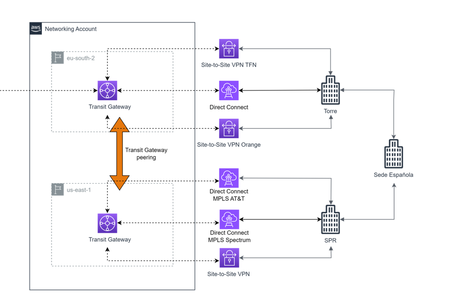

# AWS Transit Gateway Peering Terraform module

Terraform module which creates AWS Transit Gateway Peering on AWS.
### Description
>In this configuration, you deploy two transit gateways, one in your account and another in the third-party account, and you attach them with a peering connection. Because the peering attachment supports static routing, you can associate a route table to the peering attachment, and you can point routes in the transit gateway route tables to the peering attachment route table. This routes traffic between the peered transit gateways.  
>Because transit gateway peering can be in the same or different AWS Regions, you can now directly peer your transit gateway to a third-party transit gateway and provide connectivity between networks in the same Region.


### Amazon Transit Gateway Peering Documentation
* [Transit Gateway Peering](https://docs.aws.amazon.com/prescriptive-guidance/latest/integrate-third-party-services/architecture-3-2.html)

These types of resources are supported:

* [Terraform EC2 Transit Gateway Peering Attachment](https://registry.terraform.io/providers/hashicorp/aws/latest/docs/resources/ec2_transit_gateway_peering_attachment)

* [Terraform EC2 Transit Gateway Peering Attachment Accepter](https://registry.terraform.io/providers/hashicorp/aws/latest/docs/resources/ec2_transit_gateway_peering_attachment_accepter)

* [Terraform EC2 Transit Gateway Route](https://registry.terraform.io/providers/hashicorp/aws/latest/docs/resources/ec2_transit_gateway_route)


## Terraform versions

Terraform v1.6.6

### Dependencies
The following resources must exist before the deployment can take place:

- AWS account.
- Transit Gateway.
- Transit Gateway Route Table.

## Architecture

 "Architecture diagram")

## Usage

```hcl
// Complete with your GHE route module
module "Peering" {
  source              = "github.com/LorenzoDTT/aral.git//networking-peering"
  providers            = { 
    aws.us_east_1 = aws.us_east_1
  }

######SPAIN#####

  transit_gateway_id_spain     = module.Transit_Gateway.transit_gateway_id_spain
  tgw_route_table_id_spain     = var.tgw_route_table_id_spain
  destination_cidr_block_spain = var.destination_cidr_block_spain
  

######NORTH VIRGINIA#####

  peer_transit_gateway_id_North_Virginia      = module.Transit_Gateway.transit_gateway_id_North_Virginia
  peer_region_North_Virginia                  = var.peer_region_North_Virginia
  destination_cidr_block_North_Virginia = var.destination_cidr_block_North_Virginia
  destination_cidr_block_North_Virginia_other = var.destination_cidr_block_North_Virginia_other 
  tgw_route_table_id_North_Virginia     = var.tgw_route_table_id_North_Virginia

}
```

## Examples

```hcl
module "Peering" {
  source              = "github.com/LorenzoDTT/aral.git//networking-peering"
  providers            = { 
    aws.us_east_1 = aws.us_east_1
  }

######SPAIN#####

  transit_gateway_id_spain     = "tgw-07dffa8eee7fdd244"
  tgw_route_table_id_spain     = "tgw-rtb-05e3f190c7983d2c1"
  destination_cidr_block_spain = "10.57.16.0/24"

######NORTH VIRGINIA#####

  peer_transit_gateway_id_North_Virginia      = "tgw-003162c06e573b1a3" 
  peer_region_North_Virginia                  = "us-east-1"
  destination_cidr_block_North_Virginia       = "10.57.57.0/24"
  destination_cidr_block_North_Virginia_other = "10.60.0.0/16" 
  tgw_route_table_id_North_Virginia           = "tgw-rtb-0e4b25bec3fe07acd"


}
```

## Requirements

| Name | Version |
|------|---------|
| terraform | ~> 0.12 |
| aws | ~> 2.54 |

## Providers

| Name | Version |
|------|---------|
| aws | >= 3.73.0 |


# Variables
## Inputs

| Name | Description | Type | Default | Required |
|------|-------------|------|---------|:--------:|
| transit\_gateway\_id\_spain | El ID de EC2 Transit Gateway. | string | `tgw-07dffa8eee7fdd244` | Yes |
| tgw\_route\_table\_id\_spain | Identifier of EC2 Transit Gateway Route Table. | string | `tgw-rtb-05e3f190c7983d2c1` | Yes |
| destination\_cidr\_block\_spain | IPv4 or IPv6 RFC1924 CIDR used for destination matches. Routing decisions are based on the most specific match. | string | `10.57.16.0/24` | Yes |
| peer\_transit\_gateway\_id\_North\_Virginia | Identifier of EC2 Transit Gateway to peer with. | string | `tgw-003162c06e573b1a3` | Yes |
| peer\_region\_North\_Virginia | Region of EC2 Transit Gateway to peer with. | string | `us-east-1` | Yes |
| destination\_cidr\_block\_North\_Virginia | IPv4 or IPv6 RFC1924 CIDR used for destination matches. Routing decisions are based on the most specific match. | string | `10.57.57.0/24` | Yes |
| destination\_cidr\_block\_North\_Virginia\_other | IPv4 or IPv6 RFC1924 CIDR used for destination matches. Routing decisions are based on the most specific match. | string | `10.60.0.0/16` | Yes |
| tgw\_route\_table\_id\_North\_Virginia| Identifier of EC2 Transit Gateway Route Table. | string | `tgw-rtb-0e4b25bec3fe07acd` | Yes |


# **Basic tf files description**

This section explain the structure and elements that represent the artifacts of product.

|Folder|Name|Description
|--|:-|--|
|Documentation|aws-tgw-peering.PNG|Architecture diagram|
|Root|README.md|Product documentation file|
|Root|main.tf|Terraform file to use in pipeline to build and release a product|
|Root|variables.tf|Terraform file to define variables|


## Authors

Module written by Deloitte